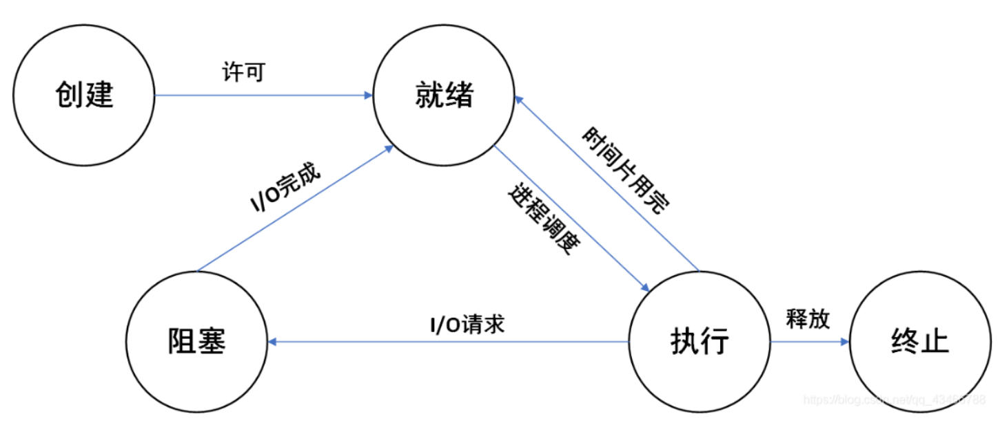

# 操作系统

## 一、操作系统概述

### 1.1 操作系统的定义与目标

定义：操作系统是控制管理计算机系统的硬软件，分配调度资源的系统软件。

目标：**方便性，有效性（提高系统资源的利用率、提高系统的吞吐量）**，可扩充性，开放性。

### 1.2 操作系统的基本功能

统一管理计算机资源：处理器资源，IO设备资源，存储器资源，文件资源;
实现了对计算机资源的抽象：IO设备管理软件提供读写接口，文件管理软件提供操作文件接;
提供了用户与计算机之间的接口：GUI（图形用户界面），命令形式，系统调用形式。

### 1.3 操作系统的特征

最基本的特征，互为存在条件：并发，共享；

（1）**并行**：指两个或多个事件可以在**同一个时刻**发生，多核CPU可以实现并行，一个cpu同一时刻只有一个程序在运行；

（2）**并发**：指两个或多个事件可以在**同一个时间间隔**发生，用户看起来是每个程序都在运行，实际上是每个程序都**交替执行**。

（3）**共享性**：操作系统的中资源可供多个并发的程序共同使用，这种形式称之为**资源共享**。

**互斥共享**：虽然可以提供给 多个进程使用，但一个时间段内只允 许一个进程访问该资源
**同时访问**：某种资源并发的被多个程序访问。
**虚拟和异步特性前提是具有并发性。**

（4）**虚拟性**：表现为把一个物理实体转变为若干个逻辑实体。

**时分复用技术**：资源在时间上进行复用，不同程序并发使用，多道程序分时使用计算机的硬件资源，提高资源的利用率。
**空分复用技术**：用来实现虚拟磁盘（物理磁盘虚拟为逻辑磁盘，电脑上的C盘、D盘等）、虚拟内存（在逻辑上扩大程序的存储容量）等，提高资源的利用率，提高编程效率。

（5）**异步性**：在多道程序环境下，允许多个进程并发执行，但由于资源等因素的限制，使进程的执行以“停停走走”的方式运行，而且每个进程执行的情况（运行、暂停、速度、完成）也是未知的。

### 1.4 操作系统的中断处理

中断机制的作用：为了在多道批处理系统中让用户进行交互；

**中断产生：**

- 发生中断时，CPU立马切换到管态，开展管理工作；（管态又叫特权态，系统态或核心态，是操作系统管理的程序执行时，机器所处的状态。）
- 发生中断后，当前运行的进程会暂停运行，由操作系统内核对中断进行处理；
- 对于不同的中断信号，会进行不同的处理。

**中断的分类：**

- 内中断（也叫“异常”、“例外”、“陷入”）------- 信号来源：CPU内部，与当前执行指令有关；
- 外中断（中断）----------信号来源：CPU外部，与当前执行指令无关。

**外中断的处理过程：**

1. 每执行完一个指令后，CPU都需要检查当前是否有外部中断 信号；
2. 如果检查到外部中断信号，则需要保护被中断进程的CPU环境（如程序状态字PSW，程序计数器PC、各种通用寄存器）把他们存储在PCB（进程控制块中）；
3. 根据中断信号类型转入相应的中断处理程序；
4. 恢复原进程的CPU环境并退出中断，返回原进程继续执行。

## 二、进程管理

### 2.1 进程管理之进程实体

为什么需要进程：

- 进程是系统进行**资源分配和调度的基本单位**；
- 进程作为程序独立运行的载体保障程序正常执行；
- 进程的存在使得操作系统资源的利用率大幅提升。

**进程控制块（PCB）：用于描述和控制进程运行的通用数据结构,记录进程当前状态和控制进程运行的全部信息，是进程存在的唯一标识。**

### 2.2 进程管理之五状态模型

**进程的状态图:**

**就绪状态**：其它资源（进程控制块、内存、栈空间、堆空间等）都准备好、只差CPU的状态。
**执行状态**：进程获得CPU，其程序正在执行。
**阻塞状态**：进程因某种原因放弃CPU的状态，阻塞进程以队列的形式放置。
**创建状态**：创建进程时拥有PCB但其它资源尚未就绪。
**终止状态**：进程结束由系统清理或者归还PCB的状态。

###### 

备注: PCB是有限的, 申请失败即创建失败, 若有**PCB而资源不足**(如内存)则处于创建态

### 2.3  线程的简介

**进程（Process）与线程（Thread）：**

线程：操作系统进行**运行调度的最小单位**。
进程：系统进行**资源分配和调度的基本单位**。

**区别与联系：**

- **本质区别**：进程是操作系统资源分配的基本单位，而线程是处理器任务调度和执行的基本单位。
- **包含关系**：一个进程至少有一个线程，线程是进程的一部分，所以线程也被称为轻权进程或者轻量级进程。
- **资源开销**：每个进程都有独立的地址空间，进程之间的切换会有较大的开销；线程可以看做轻量级的进程，同一个进程内的线程共享进程的地址空间，每个线程都有自己独立的运行栈和程序计数器，线程之间切换的开销小。
- **影响关系**：一个进程崩溃后，在保护模式下其他进程不会被影响，但是一个线程崩溃可能导致整个进程被操作系统杀掉，所以多进程要比多线程健壮。

### 	

### 2.4 线程的实现

#### 用户线程

**由一组用户级线程函数来完成线程的管理, 包括线程的创建, 终止, 同步和调度等。**

特点:

- 由线程库函数来维护, 可以用于不支持线程技术的多进程操作系统。
- 不需要从用户态切换到内核态, 速度快。但调度仍然是进程为单位
- 当进程某个线程发出系统调用的请求时, 会把整个进程都阻塞起来, 影响其他线程的正常运行。
- 对线程的调度算法可以自定义

#### 内核线程

**在操作系统的内核实现线程机制, 由操作系统内核来完成线程的创建, 终止, 管理。**

特点:

- PCB和TCB都存在内核空间中, 由内核维护, 一般的用户程序不能访问。
- 线程的创建, 终止和切换都是通过系统调用的方式来进行, 需要从用户态转换到系统态, 开销较大。
- 某个线程引起的系统调用而被阻塞, 不会影响到其他线程的运行。
- 线程是CPU调度的基本单位, 时间片是分配给线程的,  进程内线程越多, 获得的CPU时间就越多。

### 2.5 进程间的通信

**低级通信:** 进程之间只能传递少量的控制信息, 如: **信号量**。

**高级通信:** 进程之间可以传送任意数量的数据, 如: **共享内存, 消息传递, 管道**。

#### **共享内存**

操作系统提供一些**API函数**, 运行多个进程把自己地址空间的某部分共享出来, 映射到相同的一块物理内存区域。分为基于**数据结构的共享**(低级通信)和**基于存储区的共享**

#### **消息传递**（套接字）

进程之间通过发送和接受消息来交换信息, 由操作系统来维护, 调用**发送和接受操作**来交换消息。

**直接通信方式原理图:**

**间接通信方式:**

#### **管道**

- 管道是一种半双工的通信机制，**只允许数据在一个方向上流动**。当需要双向通信时，需要建立两个独立的管道。它主要用于具**有亲缘关系的进程**之间进行通信，例如父子进程或者兄弟进程。
- 管道在操作系统中单独构成一种独立的文件系统，但与普通文件不同，它只存在于内存中，不属于任何文件系统。管道两端的进程将其视为一个文件，通过写入和读取数据来进行通信。
- 数据在管道中的读取和写入是按照**先进先出**的原则进行的。一个进程向管道中写入的内容被另一个进程从管道的另一端读取。写入的内容被添加在管道缓冲区的末尾，并且从缓冲区的头部逐个读取。

### 2.6 进程的同步

#### 进程的互斥与同步

如果当前有一个进程正在使用共享数据, 那么其他进程暂时不能去访问该共享数据。

- **互斥的原因**: CPU只有一个, 多个进程竞争的访问同一个共享资源。
- **临界区**: 对共享内存或文件的访问, 可能会引起竞争状态的那段程序。
- **临界资源**: 需要互斥访问的共享资源。

原则:

- **空闲让进**: 临界区空闲时，可以允许一个请求进入临界区的进程立即进入临界区；
- **忙则等待**: 当已有进程进入临界区时，其他试图进入临界区的进程必须等待；
- **有限等待**: 对请求访问的进程，应保证能在有限时间内进入临界区（保证不会饥饿）；
- **让权等待**: 当进程不能进入临界区时，应立即释放处理机，防止进程忙等待。

#### 信号量

信号量是一个**计数器**，用于控制多个进程对共享资源的访问，其主要目的是实现进程间的同步。

使用信号量的基本流程如下：

1. 创建一个信号量：调用者需要指定初始值，通常为1或0，用于控制共享资源的访问权限。
2. 等待信号量：该操作会测试信号量的值，如果其值小于等于0，进程将被阻塞，直到信号量的值大于0。这个操作也被称为**P操作**。
3. 发送信号量：该操作将信号量的值加1，以允许其他等待进程继续执行。这个操作也被称为**V操作**。
4. 为了确保信号量操作的原子性，信号量通常在内核中实现。在Linux环境中，有三种主要类型的信号量：Posix信号量（Portable Operating System Interface for Unix），有名信号量（使用Posix IPC命名标识），以及基于内存的Posix信号量（存储在共享内存区中）。此外，还有System V信号量，它也常用于进程间或线程间的同步。

#### 管程

`可以将管程理解为一个房间，这个房间里有一些共享的资源，比如变量、队列等。同时，房间里有一个门，只有一把钥匙。多个线程或进程需要访问房间内的资源时，它们需要先获得这把钥匙，一次只能有一个线程或进程持有钥匙，进入房间并访问资源。其他线程或进程必须等待，直到当前持有钥匙的线程或进程释放钥匙，才能获得钥匙进入房间。`

`此外，管程还提供了条件变量，类似于房间内的提示牌。线程在进入房间后，如果发现某个条件不满足（比如队列为空），它可以通过条件变量来知道自己需要等待，暂时离开房间，并将钥匙交给下一个等待的线程。当其他线程满足了等待的条件（比如向队列中添加了元素），它可以通过条件变量通知告诉正在等待的线程，使其重新获得钥匙进入房间，并继续执行。`

管程由以下几个主要部分组成：

- **共享变量**：管程中包含了共享的变量或数据结构，多个线程或进程需要通过管程来访问和修改这些共享资源。
- **互斥锁（Mutex）**：互斥锁是管程中的一个关键组成部分，用于确保在同一时间只有一个线程或进程可以进入管程。一旦一个线程或进程进入管程，其他线程或进程必须等待，直到当前线程或进程退出管程。
- **条件变量（Condition Variables）**：条件变量用于实现线程或进程之间的等待和通知机制。当一个线程或进程需要等待某个条件满足时（比如某个共享资源的状态），它可以通过条件变量进入等待状态。当其他线程或进程满足了这个条件时，它们可以通过条件变量发送信号来唤醒等待的线程或进程。
- **管程接口（对管程进行操作的函数）**：管程还包括了一组操作共享资源的接口或方法。这些接口定义了对共享资源的操作，并且在内部实现中包含了互斥锁和条件变量的管理逻辑。其他线程或进程通过调用这些接口来访问共享资源，从而确保了对共享资源的有序访问。

#### 生产者 - 消费者问题

有一群生产者进程在生产产品，并将这些产品提供给消费者进程进行消费，生产者进程和消费者进程可以并发执行，在两者之间设置了一个具有n个缓冲区的缓冲池，生产者进程需要将所生产的产品放到缓冲区中（+1操作），消费者进程可以从缓冲区取走产品消费（-1操作）。

#### 哲学家就餐问题

5 个沉默寡言的哲学家围坐在圆桌前，每人面前一盘意面。叉子放在哲学家之间的桌面上。（5 个哲学家，5 根叉子）

所有的哲学家都只会在思考和进餐两种行为间交替。哲学家只有同时拿到左边和右边的叉子才能吃到面，而同一根叉子在同一时间只能被一个哲学家使用。每个哲学家吃完面后都需要把叉子放回桌面以供其他哲学家吃面。只要条件允许，哲学家可以拿起左边或者右边的叉子，但在没有同时拿到左右叉子时不能进食。

假设面的数量没有限制，哲学家也能随便吃，不需要考虑吃不吃得下。
设计一个进餐规则（并行算法）使得每个哲学家都不会挨饿；也就是说，在没有人知道别人什么时候想吃东西或思考的情况下，每个哲学家都可以在吃饭和思考之间一直交替下去。

**解决思路**

1) **最多同时允许4个哲学家拿筷子**

2) **要求奇数号哲学家先拿左边的筷子, 偶数号哲学家刚好相反**
   
3) **仅当一个哲学家左右两支筷子都可用时才允许他抓起筷子**